# Vulnerability Assessment and Penetration Testing (VAPT) Report

My VAPT report for the CSC5215 – Network Defense and Ethical Hacking [MScCS]

## Cybersecurity Lab 💻
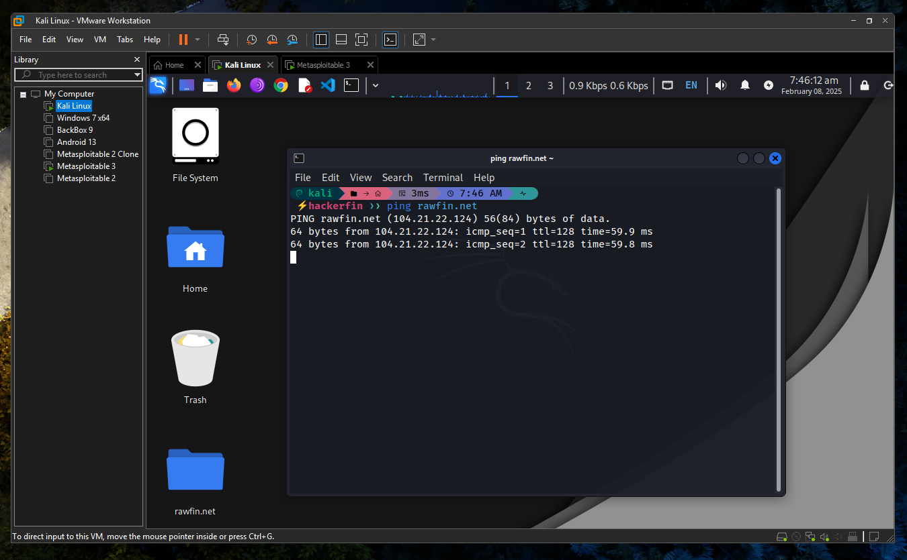

## Nessus Essentials Vulnerability Scanner Tool
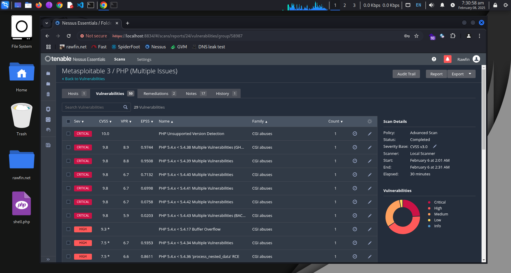

## Greenbone Vulnerability Management (GVM)
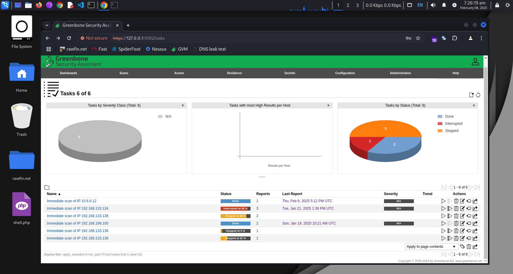

## Zenmap
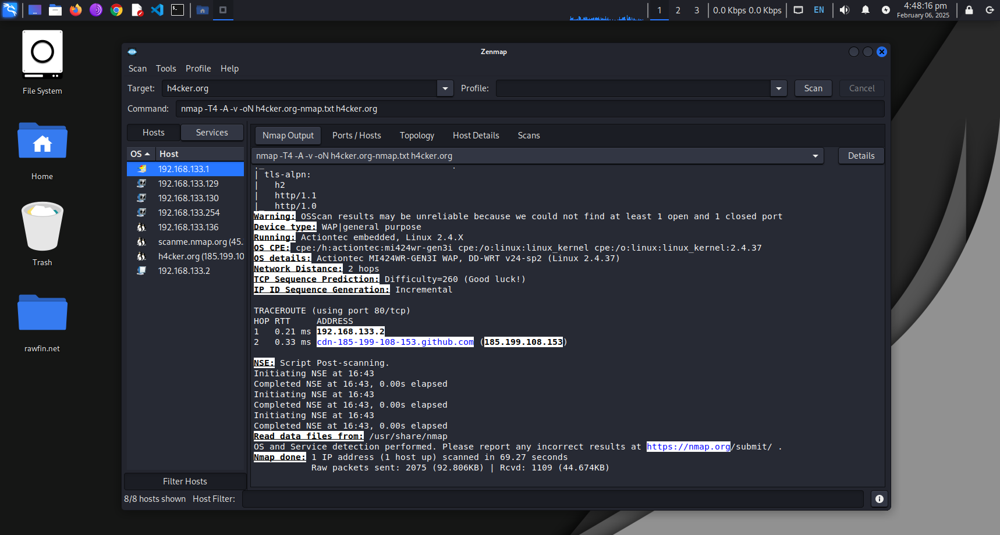

## SpiderFoot
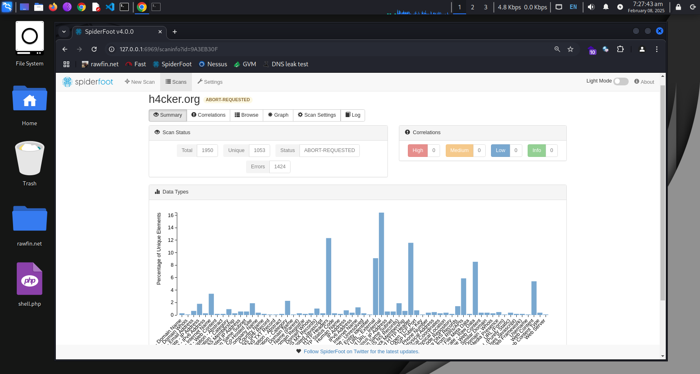
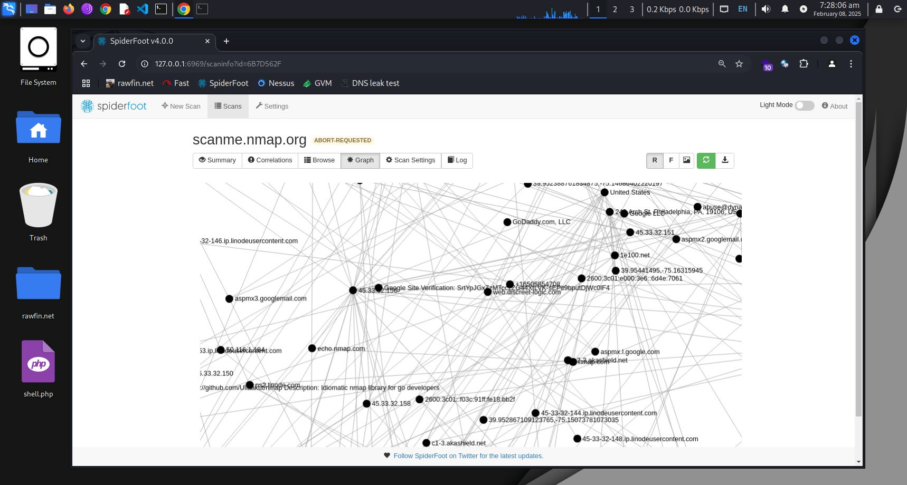

## Websploit VMs
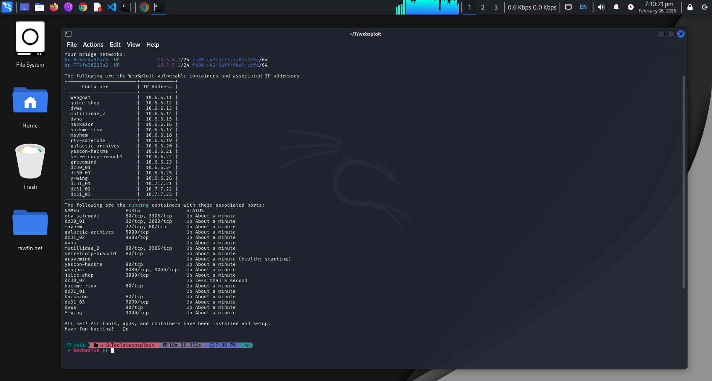
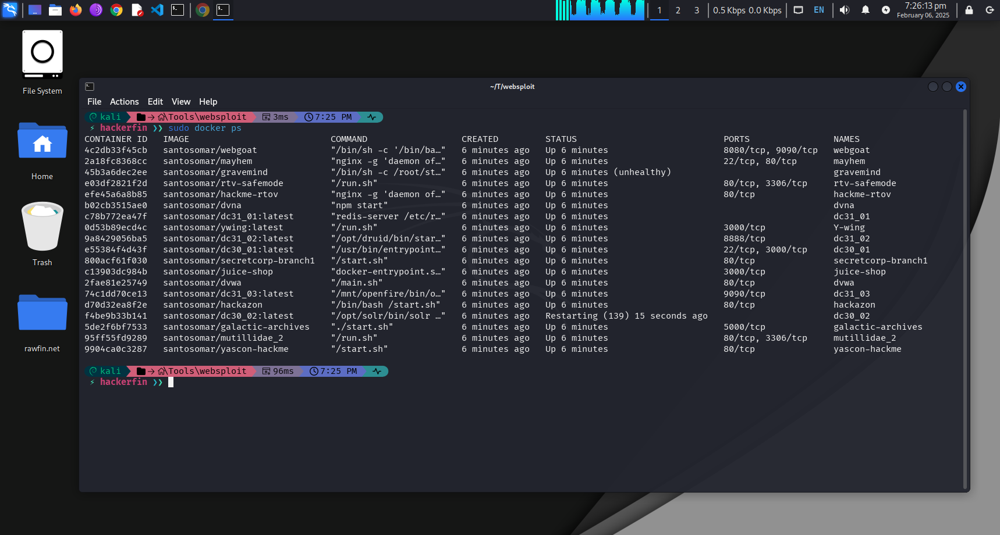

## OWASP ZAP
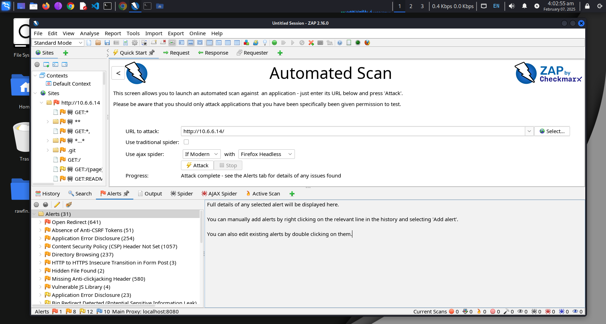
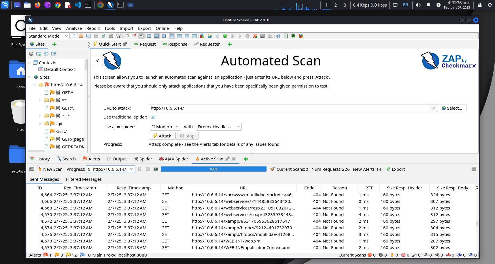

## Wappalyzer

## Gobuster
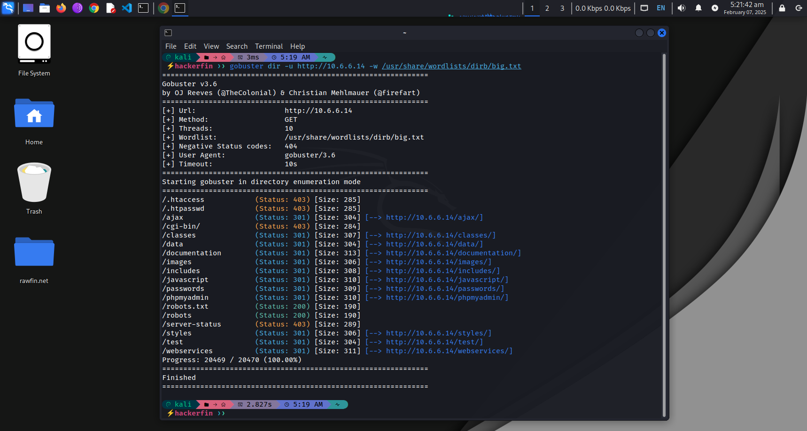

## Metasploit Framework (MSF)
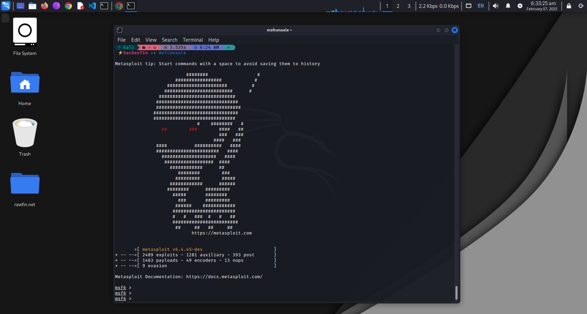

## Nmap
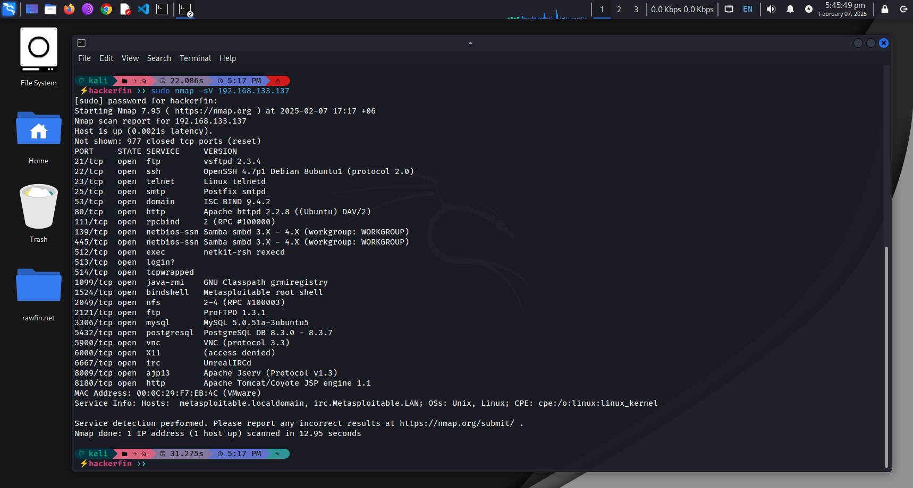
