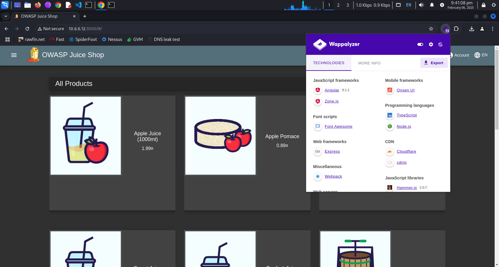

# Vulnerability Assessment and Penetration Testing (VAPT) Report

My VAPT report for the CSC5215 – Network Defense and Ethical Hacking [MScCS]

## Cybersecurity Lab 💻

## Nessus Essentials Vulnerability Scanner Tool

## Greenbone Vulnerability Management (GVM)

## Zenmap

## SpiderFoot

## Websploit VMs

## OWASP ZAP

## Wappalyzer

## Gobuster

## Metasploit Framework (MSF)

## Nmap

